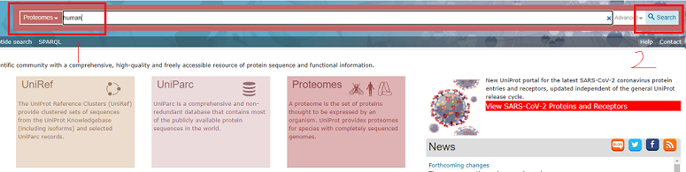

## 从uniprot下载人类蛋白质序列流程

#### 访问 https://www.uniprot.org/

#### 上方搜索栏先选择 Proteomes，然后输入 human，最后点击search

#### 搜索结果中的Homo sapiens (Human)是需要的结果，点击左侧的 UP000005640

#### 点击download，选择 Download protein entries from all 26 components，格式选择 FASTA(canonical&isoform)，点击 GO 下载

